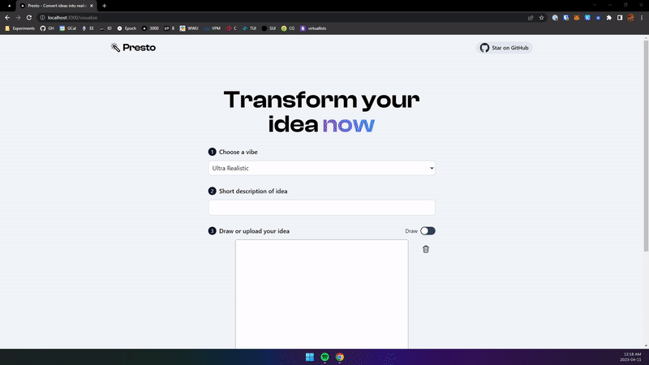

# Presto - Transform your ideas with AI

Presto is an AI-powered tool that can convert hand-drawn scribbles to quality sketches, photos, paintings, and more to help you quickly iterate on ideas.

Built using [Next.js](https://nextjs.org), [TypeScript](https://typescriptlang.org), and [Tailwind](https://tailwindcss.com).

Powered by [Vercel](https://vercel.com), [Replicate](https://replicate.com), and [Upload](https://upload.io).

[Try it yourself!](https://presto.app)

## Deploy

Run your own version of Presto by deploying on Vercel.

## Running Locally

1. Clone the repository

`git clone https://github.com/haardikk21/presto`

2. Install `pnpm` if you don't already have it (Optional)

Read the guide here - [https://pnpm.io/installation](https://pnpm.io/installation)

3. Install dependencies

`pnpm install`

4. Setup environment variables

Copy `.env.example` to `.env` and add `REPLICATE_API_KEY` and `NEXT_PUBLIC_UPLOAD_PUBLIC_KEY`

5. Run the project

`pnpm dev`

## Contributions

Contributions are open to all. Feel free to open issues and/or pull requests.

## Contact

Reach out to me on [Twitter @haardikkk](https://twitter.com/haardikkk) if you have any questions, ideas, or suggestions!

## Acknowledgements

- [@nutlope](https://twitter.com/nutlope) for inspiration through RoomGPT

## License

This project is licensed under the open source MIT License.
